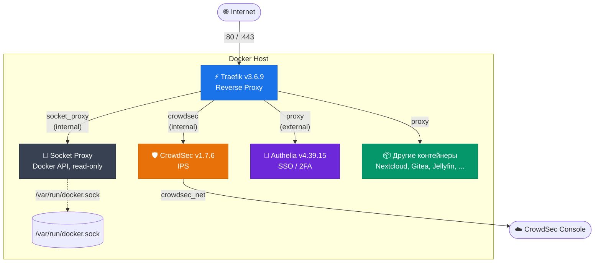
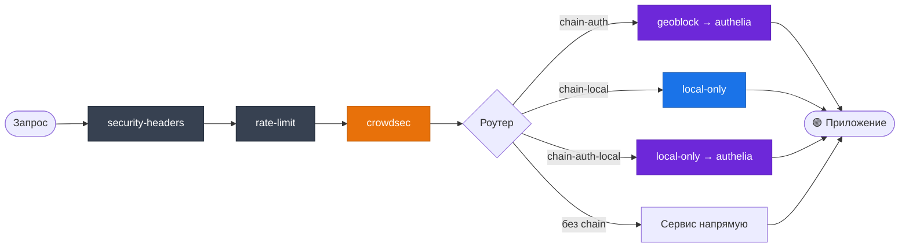

# 🛡️ Traefik Homelab Stack

Безопасный reverse proxy стек для домашнего сервера: **Traefik v3** + **CrowdSec** + **Authelia** + **Socket Proxy**.

## Архитектура



### Сети

| Сеть | Тип | Назначение |
|---|---|---|
| `proxy` | external | Общая сеть для всех проксируемых сервисов |
| `socket_proxy` | internal | Traefik ↔ Socket Proxy (Docker API) |
| `crowdsec` | internal | Traefik ↔ CrowdSec (bouncer API) |
| `crowdsec_net` | bridge | CrowdSec — доступ к обновлениям и консоли |

### Цепочки middleware

На уровне entrypoint `websecure` автоматически применяется **базовая защита** (`chain-base`):



| Chain | Middleware | Когда использовать |
|---|---|---|
| *(без chain)* | только base с entrypoint | Публичные сервисы |
| `chain-auth@file` | geoblock → authelia | Внешний доступ + 2FA |
| `chain-local@file` | local-only | Только LAN |
| `chain-auth-local@file` | local-only → authelia | LAN + 2FA |

---

## Быстрый старт

### 1. Создать директории

```bash
mkdir -p /mnt/docker-volumes/traefik/{acme,logs}
mkdir -p /mnt/docker-volumes/crowdsec/{data,config}
mkdir -p /mnt/docker-volumes/authelia
```

### 2. Создать Docker-сеть

```bash
docker network create proxy
```

### 3. Настроить `.env`

```bash
cp .env.example .env   # или создай вручную
```

Заполнить все значения:

```env
DOMAIN=example.com

CF_DNS_API_TOKEN=<токен Cloudflare API с правами DNS:Edit>
ACME_EMAIL=admin@example.com

CROWDSEC_BOUNCER_API_KEY=<сгенерировать после первого запуска CrowdSec>
CROWDSEC_ENROLL_KEY=<опционально, ключ из app.crowdsec.net>

AUTHELIA_JWT_SECRET=<64 случайных hex-символа>
AUTHELIA_SESSION_SECRET=<64 случайных hex-символа>
AUTHELIA_STORAGE_ENCRYPTION_KEY=<64 случайных hex-символа>
```

Генерация секретов:

```bash
openssl rand -hex 32   # повторить 3 раза для каждого секрета
```

### 4. Настроить пользователя Authelia

```bash
# Сгенерировать хеш пароля
docker run --rm authelia/authelia:4.39.15 \
  authelia crypto hash generate argon2 --password 'YOUR_PASSWORD'
```

Скопировать хеш в `/mnt/docker-volumes/authelia/users_database.yml`:

```yaml
users:
  admin:
    displayname: "Admin"
    password: "$argon2id$v=19$m=65536,t=3,p=4$<HASH>"
    email: admin@example.com
    groups:
      - admins
      - users
```

### 5. Настроить DNS

В Cloudflare (или другом DNS-провайдере) добавить:

```
A       example.com        → <IP сервера>
CNAME   *.example.com      → example.com
```

### 6. Запустить стек

```bash
docker compose up -d
```

### 7. Зарегистрировать CrowdSec bouncer

```bash
# Получить API-ключ для bouncer
docker exec crowdsec cscli bouncers add traefik-bouncer

# Вставить полученный ключ в .env → CROWDSEC_BOUNCER_API_KEY
# Перезапустить traefik
docker compose restart traefik
```

### 8. Проверка

- `https://traefik.example.com` — Dashboard (только из LAN + 2FA)
- `https://auth.example.com` — Портал Authelia

---

## Подключение других сервисов

### Из отдельного `docker-compose.yaml`

Чтобы сервис из другого compose-файла появился в Traefik, нужны **2 вещи**: подключить его к сети `proxy` и навесить labels.

#### Пример: Nextcloud (внешний доступ + 2FA)

```yaml
networks:
  proxy:
    external: true

services:
  nextcloud:
    image: nextcloud:latest
    container_name: nextcloud
    restart: unless-stopped
    networks:
      - proxy
    # порты НЕ пробрасывать — Traefik обращается к контейнеру напрямую
    labels:
      - "traefik.enable=true"
      - "traefik.http.routers.nextcloud.rule=Host(`cloud.example.com`)"
      - "traefik.http.routers.nextcloud.middlewares=chain-auth@file"
      - "traefik.http.services.nextcloud.loadbalancer.server.port=80"
```

#### Пример: Portainer (только LAN + 2FA)

```yaml
networks:
  proxy:
    external: true

services:
  portainer:
    image: portainer/portainer-ce:latest
    container_name: portainer
    restart: unless-stopped
    networks:
      - proxy
    labels:
      - "traefik.enable=true"
      - "traefik.http.routers.portainer.rule=Host(`portainer.example.com`)"
      - "traefik.http.routers.portainer.middlewares=chain-auth-local@file"
      - "traefik.http.services.portainer.loadbalancer.server.port=9000"
```

#### Пример: Публичный сайт (без аутентификации)

```yaml
networks:
  proxy:
    external: true

services:
  homepage:
    image: nginx:alpine
    container_name: homepage
    restart: unless-stopped
    networks:
      - proxy
    labels:
      - "traefik.enable=true"
      - "traefik.http.routers.homepage.rule=Host(`example.com`)"
      # Без middlewares — только base (headers + rate-limit + crowdsec)
      - "traefik.http.services.homepage.loadbalancer.server.port=80"
```

### Шаблон labels (копировать)

```yaml
labels:
  - "traefik.enable=true"
  - "traefik.http.routers.SERVICE_NAME.rule=Host(`subdomain.${DOMAIN}`)"
  - "traefik.http.routers.SERVICE_NAME.middlewares=CHAIN@file"       # см. таблицу выше
  - "traefik.http.services.SERVICE_NAME.loadbalancer.server.port=PORT"
```

> **Замени**: `SERVICE_NAME` (уникальное имя), `subdomain`, `CHAIN` (`chain-auth`, `chain-local`, `chain-auth-local` или убери строку), `PORT` (порт приложения внутри контейнера).
> 
> `entrypoints` и `certresolver` указывать **не нужно** — wildcard сертификат и entrypoint `websecure` настроены глобально.

---

## Структура проекта

```
traefik/
├── .env                          # Секреты (НЕ коммитится)
├── .gitignore
├── docker-compose.yaml           # Основной стек
├── README.md
│
├── traefik/
│   ├── traefik.yaml              # Статическая конфигурация Traefik
│   └── dynamic/
│       ├── middlewares.yaml       # Middleware и цепочки
│       └── tls.yaml              # TLS опции
│
├── authelia/
│   ├── configuration.yml         # Конфигурация Authelia
│   └── users_database.yml        # Шаблон базы пользователей
│
└── crowdsec/
    └── acquis.yaml               # Источники логов для CrowdSec
```

**Данные** (вне репозитория):

```
/mnt/docker-volumes/
├── traefik/
│   ├── acme/                     # Let's Encrypt сертификаты
│   └── logs/                     # Access log (читается CrowdSec)
├── crowdsec/
│   ├── data/                     # БД CrowdSec
│   └── config/                   # Конфиг CrowdSec (автогенерация)
└── authelia/
    ├── db.sqlite3                # БД Authelia
    ├── users_database.yml        # Реальная база пользователей
    └── notifications.txt         # Уведомления (filesystem notifier)
```

---

## Безопасность

| Мера | Реализация |
|---|---|
| Docker Socket | Проксируется через Socket Proxy (read-only, минимум разрешений) |
| Сетевая изоляция | Internal-сети для socket_proxy и crowdsec |
| Привилегии | `no-new-privileges` на всех контейнерах |
| TLS | Минимум TLS 1.2, только сильные cipher suites, HSTS с preload |
| Заголовки | X-Content-Type-Options, Referrer-Policy, Permissions-Policy |
| Rate-limit | 50 rps / burst 100 per IP (`sourceCriterion.ipStrategy`) |
| Брутфорс | Authelia: 3 попытки / 5 мин → бан на 30 мин |
| IPS | CrowdSec анализирует access log, блокирует по crowd-sourced спискам |
| WAF | CrowdSec AppSec — fail-close при недоступности (`crowdsecAppsecUnreachableBlock: true`) |
| Geo-blocking | Плагин geoblock — разрешён только трафик из RU (включая портал Authelia) |
| Healthcheck | Все контейнеры (traefik, crowdsec, authelia) с healthcheck |
| Секреты | `.env` + `.gitignore`, никаких паролей в коде |
